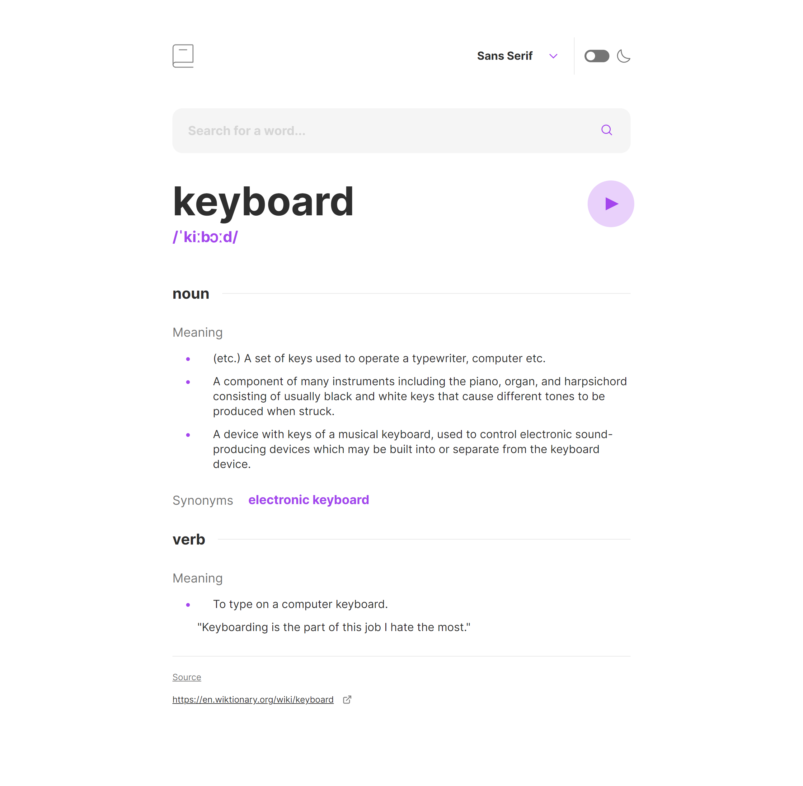

# Frontend Mentor - Dictionary web app solution

This is a solution to the [Dictionary web app challenge on Frontend Mentor](https://www.frontendmentor.io/challenges/dictionary-web-app-h5wwnyuKFL). Frontend Mentor challenges help you improve your coding skills by building realistic projects.

## Table of contents

-   [Overview](#overview)
    -   [The challenge](#the-challenge)
    -   [Screenshot](#screenshot)
    -   [Links](#links)
-   [My process](#my-process)
    -   [Built with](#built-with)
    -   [What I learned](#what-i-learned)
    -   [Useful resources](#useful-resources)
-   [Author](#author)
-   [Acknowledgments](#acknowledgments)

## Overview

### The challenge

Users should be able to:

-   Search for words using the input field
-   See the Free Dictionary API's response for the searched word
-   See a form validation message when trying to submit a blank form
-   Play the audio file for a word when it's available
-   Switch between serif, sans serif, and monospace fonts
-   Switch between light and dark themes
-   View the optimal layout for the interface depending on their device's screen size
-   See hover and focus states for all interactive elements on the page
-   **Bonus**: Have the correct color scheme chosen for them based on their computer preferences. _Hint_: Research `prefers-color-scheme` in CSS.

### Screenshot

### Links

-   Solution URL: [Solution URL](https://github.com/Andro87/dictionary-web-app.git)
-   Live Site URL: [Live site URL ](https://your-live-site-url.com)

## My process

### Built with

-   Semantic HTML5 markup
-   SASS / SCSS
-   Flexbox
-   Mobile-first workflow
-   [React](https://reactjs.org/) - JS library
-   [Next.js](https://nextjs.org/) - React framework

### What I learned

Use this section to recap over some of your major learnings while working through this project. Writing these out and providing code samples of areas you want to highlight is a great way to reinforce your own knowledge.

To see how you can add code snippets, see below:

### Useful resources

-   [How to Play Sound on Button Click in JavaScript](https://dev.to/shantanu_jana/how-to-play-sound-on-button-click-in-javascript-3m48) -This article helped me to learn how to play sound when clicking a button instead of using the HTML audio element.
-   [Understand how to pass data in React](https://blog.devgenius.io/how-to-pass-data-from-child-to-parent-in-react-33ed99a90f43#:~:text=While%20there%20is%20no%20direct,data%20from%20the%20child%20component.) -This article helped me to improve my understanding of the Parent-Child relationship in React. I'd recommend it to anyone still learning this concept.

## Author

-   Frontend Mentor - [@yourusername](https://www.frontendmentor.io/profile/Ando87)

## Acknowledgments

This is where you can give a hat tip to anyone who helped you out on this project. Perhaps you worked in a team or got some inspiration from someone else's solution. This is the perfect place to give them some credit.
